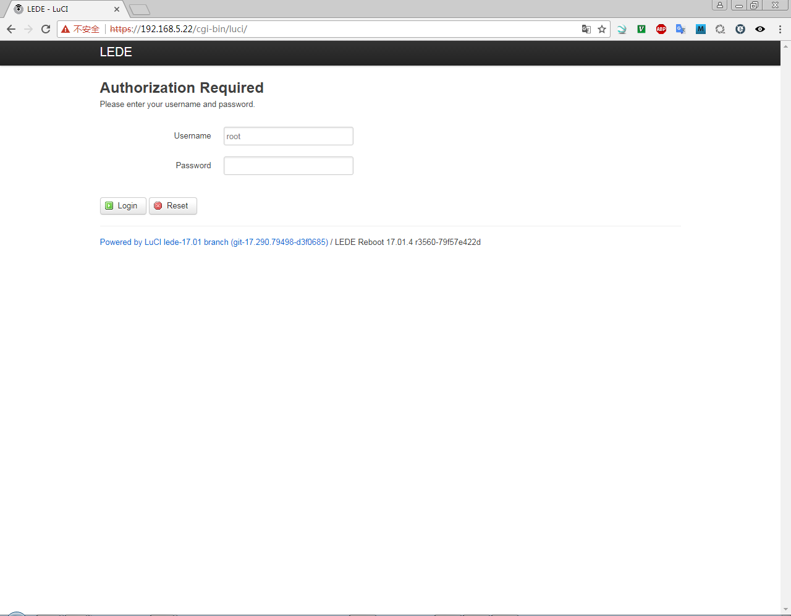

# OpenWrt

The OpenWrt build system is a set of Makefiles and patches that allows users to easily generate both a cross-compilation toolchain and a root filesystem for embedded systems. The cross-compilation toolchain uses musl, a tiny C standard library.

musl is a C standard library intended for operating systems based on the Linux kernel, released under the MIT License. It was developed by Rich Felker with the goal to write a clean, efficient and standards-conformant libc implementation.

A compilation toolchain is the set of tools used to compile code for your system. It consists of:  
* a compiler (in our case, gcc / deb: gcc)
* binary utils like assembler and linker (in our case, binutils / deb: binutils )
* a C standard library (for example GNU Libc, musl-libc, uClibc or dietlibc).

The OpenWrt Makefile has its own syntax, different from the conventional Makefile of Linux make tool. The OpenWrt Makefile defines the meta information of the package, where to download the package, how to compile, where to install the compiled binaries, etc. See How to Build OpenWrt Application Package for more detail.

Feeds are additional predefined package build recipes for OpenWrt Buildroot. The list of usable feeds is configured from the feeds.conf file (or feeds.conf.default when feeds.conf does not exist). This file contains a list of feeds, one per line, and any number of empty lines. Comments begin with # and extend to the end of a line and are ignored during parsing. Each feed line consists of 3 whitespace-separated components: The feed method, the feed name, and the feed source.  
  ```
  zengjf@desk-ubuntu:~/openwrt-17.01.4$ ./scripts/feeds install -a
  Installing all packages from feed packages.
  Installing all packages from feed luci.
  Installing all packages from feed routing.
  Installing all packages from feed telephony.
  zengjf@desk-ubuntu:~/openwrt-17.01.4$ cat feeds.conf.default
  src-git packages https://git.lede-project.org/feed/packages.git^cd5c448758f30868770b9ebf8b656c1a4211a240
  src-git luci https://git.lede-project.org/project/luci.git^d3f0685d63c1291359dc5dd089c82fa1e150e0c6
  src-git routing https://git.lede-project.org/feed/routing.git^d11075cd40a88602bf4ba2b275f72100ddcb4767
  src-git telephony https://git.lede-project.org/feed/telephony.git^ac6415e61f147a6892fd2785337aec93ddc68fa9
  zengjf@desk-ubuntu:~/openwrt-17.01.4$ ./scripts/feeds install packages
  WARNING: No feed for package 'packages' found, maybe it's already part of the standard packages?
  zengjf@desk-ubuntu:~/openwrt-17.01.4$
  ```

## Install Package

```
sudo apt-get install g++
sudo apt-get install libncurses5-dev
sudo apt-get install zlib1g-dev
sudo apt-get install bison
sudo apt-get install flex
sudo apt-get install unzip
sudo apt-get install autoconf
sudo apt-get install gawk
sudo apt-get install make
sudo apt-get install gettext
sudo apt-get install gcc
sudo apt-get install binutils
sudo apt-get install patch
sudo apt-get install bzip2
sudo apt-get install libz-dev
sudo apt-get install asciidoc
sudo apt-get install subversion
sudo apt-get install sphinxsearch
sudo apt-get install libtool
sudo apt-get install sphinx-common
sudo apt-get install libssl-dev
sudo apt-get install libssl0.9.8
sudo apt-get install git-core
sudo apt-get install build-essential
sudo apt-get install mercurial
sudo apt-get install libssl-dev libncurses5-dev unzip
sudo apt-get install subversion mercurial
```

## Clone Repo

```
git clone git://git.openwrt.org/openwrt.git
cd openwrt
./scripts/feeds update -a
./scripts/feeds install -a
```

## Make

make menuconfig中显示貌似不支持打包整bz2的文档，只能是gz的文档，所以最好root权限解压gz再打包成bz2的文档。

* `make`  
  ```
  zengjf@desk-ubuntu:~/openwrt-17.01.4$ make
   make[1] world
   make[2] target/compile
   make[3] -C target/linux compile
   make[2] package/cleanup
   make[2] package/compile
   make[3] -C package/libs/toolchain compile
   make[3] -C package/libs/libnl-tiny compile
   make[3] -C package/libs/libjson-c compile
   make[3] -C package/utils/lua compile
   make[3] -C package/libs/libubox compile
   make[3] -C package/system/ubus compile
   make[3] -C package/system/uci compile
   make[3] -C package/network/config/netifd compile
   make[3] -C package/system/ubox compile
   make[3] -C package/libs/ncurses host-compile
   make[3] -C package/libs/ncurses compile
   make[3] -C package/utils/util-linux compile
   make[3] -C package/libs/lzo compile
   make[3] -C package/libs/zlib compile
   make[3] -C package/utils/mtd-utils compile
   make[3] -C package/system/fstools compile
   make[3] -C package/system/fwtool host-compile
   make[3] -C package/system/fwtool compile
   make[3] -C package/system/procd compile
   make[3] -C package/system/usign host-compile
   make[3] -C package/utils/jsonfilter compile
   make[3] -C package/system/lede-keyring compile
   make[3] -C package/system/usign compile
   make[3] -C package/base-files compile
   make[3] -C package/boot/uboot-envtools compile
   make[3] -C feeds/luci/modules/luci-base host-compile
   make[3] -C package/firmware/linux-firmware compile
   make[3] -C package/firmware/prism54-firmware compile
   make[3] -C package/kernel/linux compile
   make[3] -C package/network/utils/iptables compile
   make[3] -C package/network/config/firewall compile
   make[3] -C package/utils/lua host-compile
   make[3] -C feeds/luci/applications/luci-app-firewall compile
   make[3] -C feeds/luci/libs/luci-lib-ip compile
   make[3] -C feeds/luci/libs/luci-lib-jsonc compile
   make[3] -C feeds/luci/libs/luci-lib-nixio compile
   make[3] -C package/network/utils/iwinfo compile
   make[3] -C package/system/rpcd compile
   make[3] -C feeds/luci/modules/luci-base compile
   make[3] -C feeds/luci/modules/luci-mod-admin-full compile
   make[3] -C feeds/luci/protocols/luci-proto-ppp compile
   make[3] -C feeds/luci/themes/luci-theme-bootstrap compile
   make[3] -C package/libs/mbedtls compile
   make[3] -C package/libs/openssl compile
   make[3] -C package/libs/ustream-ssl compile
   make[3] -C package/network/services/uhttpd compile
   make[3] -C feeds/luci/protocols/luci-proto-ipv6 compile
   make[3] -C feeds/luci/collections/luci compile
   make[3] -C package/libs/uclient compile
   make[3] -C package/network/ipv6/odhcp6c compile
   make[3] -C package/network/services/dnsmasq compile
   make[3] -C package/network/services/dropbear compile
   make[3] -C package/network/services/odhcpd compile
   make[3] -C package/libs/libpcap compile
   make[3] -C package/network/utils/linux-atm compile
   make[3] -C package/network/utils/resolveip compile
   make[3] -C package/network/services/ppp compile
   make[3] -C package/system/mtd compile
   make[3] -C package/system/opkg compile
   make[3] -C package/utils/busybox compile
   make[3] -C package/utils/bzip2 compile
   make[3] -C package/utils/px5g compile
   make[2] package/install
   make[3] -C package/libs/libubox host-compile
   make[3] -C package/system/opkg host-compile
   make[3] package/preconfig
   make[2] target/install
   make[3] -C target/linux install
   make[2] package/index
   make[2] diffconfig
   make[2] checksum
  zengjf@desk-ubuntu:~/openwrt-17.01.4$
  ```
* `make -j1 V=s`

## Output Dir

```
root@desk-ubuntu:/home/zengjf/openwrt-17.01.4/bin/targets/imx6/generic# ls
config.seed                      lede-imx6-imx6q-gw54xx.dtb
lede-imx6-generic.manifest       lede-imx6-imx6q-gw551x.dtb
lede-imx6-generic-rootfs.tar.gz  lede-imx6-imx6q-gw552x.dtb
lede-imx6-imx6dl-gw51xx.dtb      lede-imx6-imx6q-gw553x.dtb
lede-imx6-imx6dl-gw52xx.dtb      lede-imx6-ventana-large-squashfs-nand.ubi
lede-imx6-imx6dl-gw53xx.dtb      lede-imx6-ventana-large-uImage
lede-imx6-imx6dl-gw54xx.dtb      lede-imx6-ventana-squashfs-bootfs.tar.gz
lede-imx6-imx6dl-gw551x.dtb      lede-imx6-ventana-squashfs-nand.ubi
lede-imx6-imx6dl-gw552x.dtb      lede-imx6-ventana-uImage
lede-imx6-imx6q-gw51xx.dtb       lede-imx6-wandboard-uImage
lede-imx6-imx6q-gw52xx.dtb       packages
lede-imx6-imx6q-gw53xx.dtb       rootfs
lede-imx6-imx6q-gw5400-a.dtb     sha256sums
root@desk-ubuntu:/home/zengjf/openwrt-17.01.4/bin/targets/imx6/generic#
```

## Start Run Log

```
VFS: Mounted root (ext3 filesystem) on device 179:2.
devtmpfs: mounted
Freeing unused kernel memory: 440K (80b38000 - 80ba6000)
init: Console is alive
init: - watchdog -
init: - preinit -
random: jshn urandom read with 11 bits of entropy available
fec 2188000.ethernet eth0: Freescale FEC PHY driver [Generic PHY] (mii_bus:phy_addr=2188000.ethernet:01, irq=-1)
IPv6: ADDRCONF(NETDEV_UP): eth0: link is not ready
Press the [f] key and hit [enter] to enter failsafe mode
Press the [1], [2], [3] or [4] key and hit [enter] to select the debug level
mount_root: mounting /dev/root
urandom-seed: Seeding with /etc/urandom.seed
procd: - early -
procd: - watchdog -
procd: - watchdog -
procd: - ubus -
procd: - init -
Please press Enter to activate this console.

BusyBox v1.25.1 () built-in shell (ash)

     _________
    /        /\      _    ___ ___  ___
   /  LE    /  \    | |  | __|   \| __|
  /    DE  /    \   | |__| _|| |) | _|
 /________/  LE  \  |____|___|___/|___|                      lede-project.org
 \        \   DE /
  \    LE  \    /  -----------------------------------------------------------
   \  DE    \  /    Reboot (17.01.4, r3560-79f57e422d)
    \________\/    -----------------------------------------------------------

root@LEDE:/# ifconfig eth0 192.168.5.22 netmask 255.255.255.0
fec 2188000.ethernet eth0: Freescale FEC PHY driver [Generic PHY] (mii_bus:phy_addr=2188000.ethernet:01, irq=-1)
IPv6: ADDRCONF(NETDEV_UP): eth0: link is not ready
root@LEDE:/# fec 2188000.ethernet eth0: Link is Up - 100Mbps/Full - flow control rx/tx
IPv6: ADDRCONF(NETDEV_CHANGE): eth0: link becomes ready

root@LEDE:/# ping 192.168.5.202
PING 192.168.5.202 (192.168.5.202): 56 data bytes
64 bytes from 192.168.5.202: seq=0 ttl=128 time=1.156 ms
64 bytes from 192.168.5.202: seq=1 ttl=128 time=0.424 ms
^C
--- 192.168.5.202 ping statistics ---
2 packets transmitted, 2 packets received, 0% packet loss
round-trip min/avg/max = 0.424/0.790/1.156 ms
root@LEDE:/#
```

## Web Page


